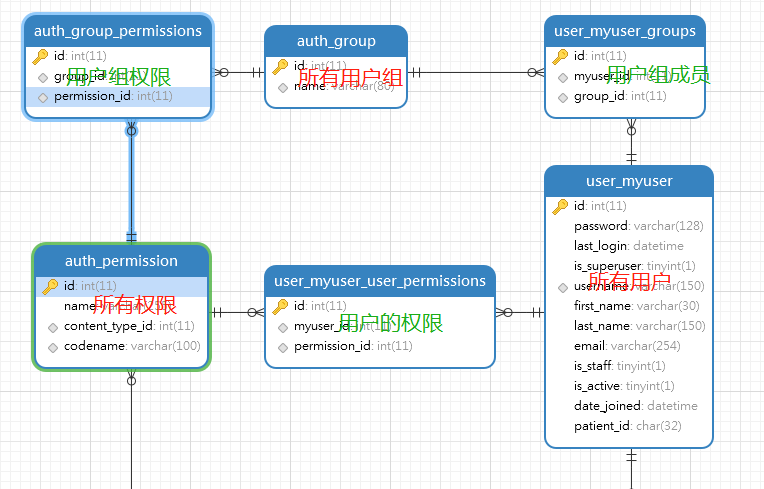

## 用户管理系统

- 用户管理的本质就是数据库中的一张或多张与用户相关的表，存储的用户的基本信息和权限及用户组等高级信息。
- 用户的登陆就是接受用户的请求信息（登陆信息），并和数据库中存储的信息相比较。判断用户是否注册和是否激活等状态，完成登陆操作。
- 注册就是在数据库中创建一条数据。但是要满足唯一性。

\# 当然上面说到的都是最基本的过程，这中间还会有一些数据的检验与验证等等操作。

\# 在 Django 中也有很好的封装。但是也要明白最基本的原理。

<!-- more -->

## Django-Auth 认证系统

- django 中用户管理系统可分为三大部分：用户信息、用户权限、用户组，对应数据库在的表分别为：auth_user、auth_permission、auth-group。
- django 的auth 的源码位于：django.contrib.auth，其中定义了很多的方法和类可供使用。
- django 只是提供了通用的身份验证系统，但是并没有提供更加复杂的功能，如密码强度检验、限制登陆尝试、第三方身份验证等功能。这些功能一般是通过第三方实现。


### 一、在 django 中使用认证系统

------

- django 是默认使用内置用户管理系统的。

- settings 中关于 Auth 的设置项。

  - ```python
    INSTALLED_APPS = [
        'django.contrib.auth',  # 身份验证框架的核心
        'django.contrib.contenttypes',  # 内容类型系统，它允许权限与您创建的模型相关联。
    ] 
    ```

  - ```python
    AUTH_PASSWORD_VALIDATORS = [
        {
            'NAME': 'django.contrib.auth.password_validation.UserAttributeSimilarityValidator',
        },
        {
            'NAME': 'django.contrib.auth.password_validation.MinimumLengthValidator',
        },
        {
            'NAME': 'django.contrib.auth.password_validation.CommonPasswordValidator',
        },
        {
            'NAME': 'django.contrib.auth.password_validation.NumericPasswordValidator',
        },
    ]  # 用户密码认证的验证器
    ```

  - ```python
    MIDDLEWARE = [
        'django.contrib.sessions.middleware.SessionMiddleware',  # 管理 跨请求的会话
        'django.contrib.auth.middleware.AuthenticationMiddleware',  # 使用会话将用户与请求相关联。
    ] 
    ```


### 二、扩展 User

------

- django 默认的 User 模型本质就是一个python 的类，一个orm 模型。只有一些必要的字段（即 auth_user 表）。如下：

> | 字段         | 说明                                                         |
> | ------------ | ------------------------------------------------------------ |
> | Id           | 主键                                                         |
> | Password     | 密码，默认使用 pbkdf2_sha256 方式加密存储                    |
> | last_login   | 最后一次登陆时间                                             |
> | is_superuser | 是否为超级用户                                               |
> | Username     | 用户名                                                       |
> | first_name   | 名                                                           |
> | last_name    | 姓                                                           |
> | Email        | 邮件                                                         |
> | is_staff     | 判断用户是否有进入 admin 系统的权限                          |
> | is_active    | 判断用户是否是激活状态，一般不删除用户，而是把该值设置为 Felse |
> | date_joined  | 创建时间                                                     |

- 这些字段在实际开发中一般是不够用的，这时就需要对其进行扩展了。一般有如下方法：

> **1.** 代理模型：当不需要数据库存储额外的信息时，只是需要一些新的方法时。可以对 User 模型进行继承和扩展。
>
> **2.** **Profile 扩展**：需要存储额外信息，但是不想改变原有的 User 模型。可以重新定义一个数据模型，并设置某个字段为 OneToOneField 使之与 User 进行关联。
>
> **3.** AbstractBaseUser 扩展：重新定义用户模型并继承致 AbstractBaseUser  类。此方法对 User 和数据库的影响很大。
>
> **4.** **AbstractUser 扩展**：重新定义用户模型并继承致 AbstractUser 类，该方法会替换原有的 User模型。（需要在 settings 中配置自定义的模型，`AUTH_USER_MODEL = 'user.MyUser'`）

\# 一般情况下推荐 Profile 和 AbstractUser 方法进行扩展。

\# AbstractUser 用于第一次数据库迁移之前。如果在进行第一次迁移后使用AbstractUser 方法，可以无法迁移，需要删除数据库和迁移文件才可以进行。

\# Profile 方法本质就是多建一张表，当然连表查询会影响性能。


***以  AbstractUser 方法为例：***一般会创建一个 user app，并在 models.py 中扩展。

> ```python
> from django.db import models
> from django.contrib.auth.models import AbstractUser
> 
> class MyUser(AbstractUser):
> patient_id = models.UUIDField(default=None, null=True, blank=True)  # 扩展一个字段
> 
> def __str__(self):
>    return self.username
> ```
>
> 
>
> ##### 扩展完成后进入后台系统，会发现一个问题：没有用户管理
>
> 这是因为我们自定义的 MyUser 没有注册到后台管理系统中。需要在 admin.py 中进行注册操作。如下：
>
> ```python
> from django.contrib import admin
> from .models import MyUser
> from django.contrib.auth.admin import UserAdmin
> 
> @admin.register(MyUser)
> class MyUserAdmin(UserAdmin):
> list_display = ['username','email']
> 
> fieldsets = list(UserAdmin.fieldsets)
> ```
>
> \# 使用的是继承 UserAdmin类。其他和正常后台配置相同


**django 除了定义好的 User 类为，还定义了 User 所需要的表单类**，如下：`django.contrib.auth.forms`

| 表单类                  | 表单字段                                   | 说明                                    |
| ----------------------- | ------------------------------------------ | --------------------------------------- |
| UserCreationForm        | username、password1、password2             | 创建新用户                              |
| UserChangeForm          | password、User模型的全部字段               | 修改用户信息                            |
| AuthenticationForm      | username、password                         | 用于登陆功能的认证功能                  |
| PasswordResetForm       | email                                      | 通过邮件方式重置密码                    |
| SetPasswordForm         | password1、password2                       | 设置密码，如果有旧密码不会对其验证      |
| PasswordChangeForm      | old_password、new_password1、new_password2 | 继承SetPasswordForm，会对旧密码进行验证 |
| AdminPasswordChangeForm | password1、password2                       | admin 后台修改密码                      |

自定义表单是可以继承上述表单类经行扩展，如：

```python
from django.contrib.auth.forms import UserCreationForm
from .models import MyUser

class MyUserCreationForm(UserCreationForm):
    class Meta(UserCreationForm.Meta):
        model = MyUser  # 指定自定的用户类
        # 在注册界面添加邮箱、手机号码、微信号码和QQ号码
        fields = UserCreationForm.Meta.fields + ('email', 'mobile', 'weChat', 'qq')
```


### 三、登陆

------

- 登陆的本质就是接受客户端的登陆信息，并与数据库信息比对，如果用户存在并且密码正确就可以完成登陆操作。
- 根据 MTV 模型，M 已经实现（MyUser），接下来分别实现 V 和 T。如下

```python
# form.py
# 定义一个简单的表单类
from django import forms

class LoginForm(forms.Form):
    username = forms.CharField(label='姓名', widget=forms.TextInput(attrs={'class': 'form-control'}))
    password = forms.CharField(label='姓名', widget=forms.PasswordInput(attrs={'class': 'form-control'}))
```

```python
# views.py
from django.shortcuts import render, redirect
from django.contrib.auth import login, authenticate
from django.urls import reverse

def login_view(request):
    if request.method == 'POST':
        form = LoginForm(request.POST)
        if form.is_valid():  # 判断表单数据
            username = form.cleaned_data.get('username')
            password = form.cleaned_data.get('password')
            user = authenticate(username=username, password=password) # 认证用户
            if user is not None:
                login(request, user)
                return redirect(reverse(viewname='user:home', args=(user.id, )))  # 重定向
            else:
                tips = '用户名或密码错误！'
        return render(request, 'login.html', locals())
    else:
        form = LoginForm()
        return render(request, 'login.html', locals())
```

```html
# login.html
<form action="" method="post">
    
    <table>
        {{ form.as_table  }}
    </table>
    <input type="submit" value="登陆">
</form>

```


### 四、注册

------

- 注册的本质就是在数据库中的用户表中创建一条记录。

```python
# form.py
from django.contrib.auth.forms import UserCreationForm
from .models import MyUser
from django import forms

class MyUserCreationForm(UserCreationForm):
    def __init__(self, *args, **kwargs):
        super(MyUserCreationForm, self).__init__(*args, **kwargs)
        # 设置 password1、password2 的样式
        self.fields['password1'].widget = forms.PasswordInput(attrs={'class': 'txt tabInput', 'placeholder':'密码,4-16位数字/字母/特殊符号(空格除外)'})
        self.fields['password2'].widget = forms.PasswordInput(attrs={'class': 'txt tabInput', 'placeholder':'重复密码'})

    class Meta(UserCreationForm.Meta):
        model = MyUser  # 指定模型
        
         # 设置需要注册的字段，默认只有 username
        fields = UserCreationForm.Meta.fields +('patient_id',)  
        # 设置字段的样式
        widgets = {
            'patient_id': forms.widgets.TextInput(attrs={'class': 'txt tabInput', 'placeholder':'患者编号'}),
        }

```

```python
# views.py
def register_view(request):
    if request.method == 'POST':
        user = MyUserCreationForm(request.POST)
        if user.is_valid():
            user.save()
            return redirect(reverse(viewname='user:login'))
        else:
            tips = str(user.errors)
        return render(request, template_name='register.html', context=locals())
    else:
        user = MyUserCreationForm()
        return render(request, template_name='register.html', context=locals())

```

```html
# register.html
<form action="" method="post">
        
        <table>
            {{ user.as_table }}
        </table>
        <input type="submit" value="提交">
    </form>

```


### 五、退出

------

- 退出当前的登陆状态，本质上的删除 session 的 user 信息，django 的 logout 已经做好了封装。
- 同样的 login 函数也封装的在 session 中加入 user 的部分。

```python
# views.py
from django.shortcuts import render, redirect
from django.contrib.auth import login, authenticate, logout

def logout_view(request):
    logout(request)
    return redirect(reverse(viewname='user:login'))

```


### 六、修改密码

------

- 首先要判断用户，再进行密码修改。


### 七、找回密码

------

- 修改密码是在用户知道密码的情况下的操作，还有一中是用户忘记密码，进行密码重置的操作。
- 一般有短信找回和邮件找回。django 是内置了发邮件的功能的。所有一般使用邮件找回

##### 1、配置邮件

> ```python
> EMAIL_BACKEND = 'django.core.mail.backends.smtp.EmailBackend'
> EMAIL_HOST= 'imap.mxhichina.com'
> EMAIL_PORT= 993
> EMAIL_HOST_USER = 'csniu@smartquerier.com'
> EMAIL_HOST_PASSWORD = 'Niu875311792'
> EMAIL_SUBJECT_PREFIX = 'website' # 为邮件标题的前缀,默认是'[django]'
> EMAIL_USE_SSL = True
> DEFAULT_FROM_EMAIL = SERVER_EMAIL = EMAIL_HOST_USER # 设置发件人
> 
> ```


### 八、用户权限和用户组

------

- 用户权限主要是对不同用户设置不同的功能使用权限，”功能“主要以模型来划分。
- 每个模型都拥有 add、change、delete 的权限项。
- django 已经内置了权限的管理，打开admin 可进行可视化的操作。
- 权限的本质就是就是数据库中 auth_user、auth_permissions、auth_groups 表的对应关系。
- 默认情况下，新创建的用户是没有设置任何权限的。（一般用户也不需要有后台管理的权限，只有内部人员才需要）
- 用户权限只适用于非超级用户

**用户和权限管理的主要数据库表如下：**

](https://imgchr.com/i/1yseIK)


#### 基本操作如下

```python
from django.contrib.auth.models import Permission，Group, User

# 查找用户、权限、用户组
user = User.object.filter()
permission = Permission.objects.filter(codename='add_produt')[0]
group = Group.object.filter()

# 判断用户权限
user.has_perm('index.add_product')  # index 为 app 名，add_product 为 auth_permissions 的codename 字段内容

# 用户权限
user.user_permissions.set([permission_list])  # 添加多个权限
user.user_permissions.add(permission)  # 添加权限
user.user_permissions.remove(permission)  # 删除权限
user.user_permissions.clear(permission)  # 清空权限
user.user_permissions。values()  # 所有权限

# 用户与用户组
user.groups.add(group)  # 绑定到用户组
user.groups.remove(group)  # 解除用户组
user.groups.clear()  # 解除所有用户组

# 用户组与用户
group.user.add(user)

# 用户组与权限
group.permission.add(permission)

```

#### 1.自定义模型权限

- 在模型类的 Meta 中进行设置如下：

```
class mymodel(model.Model):
    class Meta:
        permissions = (
        ('visit_Product', 'Can visit Product')  # 分别对应 auth_permission 中的 codename 和那么字段
        )

```


#### 2.视图函数中的权限判断

- 判断当前用户是否是在登陆状态。

> - 使用 login_required 装饰器，对当前访问进行判断。可进行预处理和重定向操作。
>
> ```python
> from django.contrib.auth.decorators import login_required
> 
> @login_required(login_url='/user/login')
> def home_view(request, user_id):
> from django.http import HttpResponse
> return HttpResponse('user id: {}'.format(str(user_id)))
> 
> ```

- 判断当前用户是否拥有相应权限。

> - 使用 permission_required 装饰器进行判断。如果没有权限可抛出异常或重定向到登陆页。
>
> ```python
> from django.contrib.auth.decorators import permission_required 
> 
> @permission_required(perm='index.visir_Product', login_url='/user/login/')
> def home_view(request, user_id):
> from django.http import HttpResponse
> return HttpResponse('user id: {}'.format(str(user_id)))
> 
> ```

> \# permission_required 的作用和内置的 has_perm 相同。

- 在模板中判断权限和用户

> - 模板中是通过上下文中的 user 对象进行**用户判断**，和 perms 对象进行**权限判断**的。
> - 这两个变量是django 在渲染模板前自动生成和传递的。
>
> ```html
>   <!-- 判断用户是否登陆 -->
> 	<P>....</p>
> 
> 
> 
> 
> 	<p>....</p>
> 	
> 
> ```


### 注意和参考

------

- 以上关于登陆、注册等实现的视图函数，都是通过自己实现逻辑和验证的。这种方法是不安全和低效的。在django 中已经定义了相应的视图函数类，在`django.contrib.auth.views` 中。可进行继承和自定义操作。
- 本文主要参考了 黄永祥老师著作的 《玩转 Django2.0》一书，和 django 的[官方文档](https://docs.djangoproject.com/zh-hans/2.1/topics/auth/)


以 django.contrib.auth.views.LoginView 为例，流程如下：

1.根据不同的请求方式 dispatch() 分配的不同的方法上：

2.get 和 post 请求的方法源码如下：

```python
# django.views.generic.edit.ProcessFormView

class ProcessFormView(View):
    """Render a form on GET and processes it on POST."""
    def get(self, request, *args, **kwargs):
        """Handle GET requests: instantiate a blank version of the form."""
        return self.render_to_response(self.get_context_data())

    def post(self, request, *args, **kwargs):
        """
        Handle POST requests: instantiate a form instance with the passed
        POST variables and then check if it's valid.
        """
        form = self.get_form()
        if form.is_valid():
            return self.form_valid(form)
        else:
            return self.form_invalid(form)

    # PUT is a valid HTTP verb for creating (with a known URL) or editing an
    # object, note that browsers only support POST for now.
    def put(self, *args, **kwargs):
        return self.post(*args, **kwargs)

```


