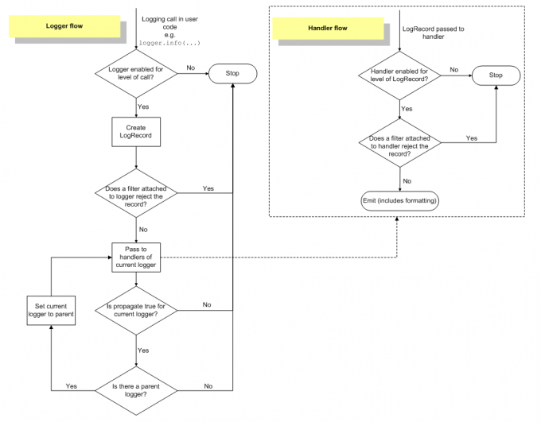

# Python-logging

python 的标准库包。提供了日志记录的 API。仅是线程安全的，多进程可参考 [ConcurrentLogHandler](https://pypi.org/project/ConcurrentLogHandler/)。

包结构：

```
logging\
	| __init__.py  # 包入口，主要模块，定义了 logger、handler、formatter、filter 等类。
	| config.py  # 定义了 配置函数以及读取配置文件的类。
	| handlers.py  # 对 handler 的扩展完善。
```

基本概念：

- Logger：日志的系统入口。
- Handler：将日志记录（logger 创建）发送到指定的目标。
- Filter：过滤日志。
- Formatter：设置日志的格式。

关系：

- 一个程序可以有多个 Logger 对象。（多个入口）（层级关系）
- 一个 Logger 对应多个 Handler。（输入到多个地方）
- 一个 Logger 对应多个 Filter。（多个过滤器）
- 一个 Handler 对应一个 Formatter。（输出格式）

<!-- more -->

#### 一、Logger

提供应用程序可以直接使用的接口。要自行实例化后才可以使用。

##### 1.实例化

```python
log = logging.getLogger(name)
```

- 使用相同的 “name” 实例化，会始终返回同一个 Logger 对象。
- 如果没有指定，将换回 `root logger`。
- "name" 可以是句点分割的层次值。类是于 python 包层次结构。**推荐**使用 `logging.getLogger(__name__)`.
- 
##### 2.配置

方法1：

使用Python代码显式的创建loggers, handlers和formatters并分别调用它们的配置函数；
| 方法                          | 说明                                                         |
| ----------------------------- | ------------------------------------------------------------ |
| logger.setLevel(logging.INFO) | 指定最低的日志级别，默认为Warning。低于lel的级别将被忽略。debug是最低的内置级别，critical为最高 |
| Logger.addHandler(hdlr)       | 增加指定的handler                                       |
| Logger.removeHandler(hdlr)    | 删除指定的handler                                       |
| Logger.addFilter(filt)        | 添加指定的filter                                        |
| Logger.removeFilter(filt)     | 删除指定的filter                                       || 等等                          |                                                              |

- 日志级别：logging.DEBUG<logging.INFO<logging.WARNING<logging.ERROR<logging.CRITICAL

如下：

```python
import logging
import sys

# 创建一个日志器logger并设置其日志级别为DEBUG
logger = logging.getLogger('simple_logger')
logger.setLevel(logging.DEBUG)

# 创建一个流处理器handler并设置其日志级别为DEBUG
handler = logging.StreamHandler(sys.stdout)
handler.setLevel(logging.DEBUG)

# 创建一个格式器formatter并将其添加到处理器handler
formatter = logging.Formatter("%(asctime)s - %(name)s - %(levelname)s - %(message)s")
handler.setFormatter(formatter)

# 为日志器logger添加上面创建的处理器handler
logger.addHandler(handler)

# 日志输出
logger.debug('debug message')
logger.info('info message')
logger.warn('warn message')
logger.error('error message')
logger.critical('critical message')
```

输出如下：

```
2019-02-26 09:44:43,982 - simple_logger - DEBUG - debug message
2019-02-26 09:44:44,000 - simple_logger - INFO - info message
2019-02-26 09:44:44,001 - simple_logger - WARNING - warn message
2019-02-26 09:44:44,001 - simple_logger - ERROR - error message
2019-02-26 09:44:44,001 - simple_logger - CRITICAL - critical message
```

- `basicConfig()` 也是这一类配置方法。主要是封装了配置代码，经行**简单基本快捷**的配置。
- 如果 root logger 已经有 handlers 配置，则不会经行任何配置。
- 默认是创建一个 StreamHandler 到 `sys.stderr`并通过`BASIC_FORMAT`格式输出。
- 也可以指定一些参数，改变默认配置。详见源代码。

```python
import logging

logging.basicConfig()
# 自定义
# logging.basicConfig(level=logging.WARNING, format='%(asctime)s - %(filename)s[line:%(lineno)d] - %(levelname)s: %(message)s')

logger = logging.getLogfig()

# 日志输出
logger.debug('debug message')
logger.info('info message')
logger.warn('warn message')
```

```
WARNING:root:warn message
```

- 只有高于 WARNING 的级别才会输出。

**方法2：**

**通过配置文件配置。**
- 读取配置文件，主要是通过 `logging.config`模块中的`fileConfig`和`dictConfig()`方法实现。
- fileConfig 本质是对 configparser 的封装。读取的 “file”。
- dictConfig 中从配置字典中读取信息。
```python
def fileConfig(fname, defaults=None, disable_existing_loggers=True):
```

- fname：配置文件。
- defaults：传给 ConfigParser 的默认值。
- 布尔值。默认为 True。表示禁用已经存在的 logger。


**配置文件格式。**
- 因为 fileConfig 是对 ConfigParser 的封装，所有 fileConfig 能够理解的格式也是基于 ConfigParser 格式的，只是在其基础上对 `section`和 `option`进行了一些规定和现在。如下：

    - 配置文件**必须**配置的 section 包含 `loggers`、`handlers`、`formatters`。
    - 通过 keys(option)来自定已经配置好的 `logger`、`handler`、`formatter`，多个用逗号分割。
    - 并且 loggers 的 keys 中**必须**要有 root。

- logger:
    - 每一个 logger、handler、formatter 都**必须**在一个单独的 section 中定义。
    - 命名规则为：[logger_loggerName]、[handler_handlerName]、[formatter_formatterName]。
    - 定义logger 的 section 中**必须**指定 level、handlers。
    - 非 root logger 还有一些额外的 option，
    - qualname（**必须**）（表示在logger层级中的名字，代码中通过这个名字得到 logger）
    - propagate（可选）（默认为1，表示将消息传递给更高层次的 logger 的 handler，一般指定为0）

- handler:
     - **必须**指定 class、args。可选 level、formatter。
    - class：handler 的类名。可以是相对 logging模块的相对值。如：FileHandler
    - args：传递给 “class” 的参数。**必须**是 tuple 类型。
    - level：等级
    - formatter：格式器。如果不指定，handler 将会以消息本身进行记录，而不会添加时间等信息。


以 fileConfig 为例如下：

```python
import logging
import logging.config

logging.config.fileConfig("logger.conf")
logger = logging.getLogger("example01")
```
```
[loggers]
keys = root

[handlers]
keys = mail, file, console

[formatters]
keys = format
 
[logger_root]
level = INFO
handlers = mail, file, console
propagate = 0
 
[handler_mail]
class = handlers.SMTPHandler
level = ERROR
formatter = format
args = ('smtp.163.com', 'sqmeddb@163.com', 'csniu@smartquerier.com', 'Errors from chemotherapy on small reports system', ('sqmeddb@163.com', 'authformeddb2018'))
 
[handler_file]
class = handlers.TimedRotatingFileHandler
level = INFO
formatter = format
args = ('log/chem.log', 'd', 1, 0, 'utf-8')
 
[handler_console]
class = StreamHandler
level = INFO
formatter = format
args = (sys.stdout,)

[formatter_format]
format=%(asctime)s %(filename)s[line:%(lineno)d] %(levelname)s %(message)s
datefmt=%m/%d/%Y %I:%M:%S %p
 
```


#### 二、handler

------

定义将日志信息发送到哪里。文件、网络、邮箱。

基本上不需要开发者关心，直接调用就可以。

一些常用的 Handler 定义在 `__init__.py `，不太常用的都定义在 `handler`中。如下

| Handler                                                      | 描述                                                         |
| ------------------------------------------------------------ | ------------------------------------------------------------ |
| logging.StreamHandler(stream)                                | 将日志消息发送到Stream，如std.out, std.err或任何file-like对象。默认 sys.stderr(控制台) |
| logging.FileHandler(filename, mode='a',encoding=None, delay=False) | 将日志消息发送到磁盘文件，默认情况下文件大小会无限增大。     |
| logging.handlers.RotatingFileHandler                         | 将日志消息发送到磁盘文件，并支持日志文件按大小切割。文件达到一定大小，会进行重命名。 |
| logging.hanlders.TimedRotatingFileHandler                    | 将日志消息发送到磁盘文件，并支持日志文件按时间切割。可设置每天、每周等。 |
| logging.handlers.HTTPHandler                                 | 将日志消息以GET或POST的方式发送给一个HTTP服务器              |
| logging.handlers.SMTPHandler                                 | 将日志消息发送给一个指定的email地址                          |
| logging.NullHandler                                          | 该Handler实例会忽略error messages，通常被想使用logging的library开发者使用来避免'No handlers could be found for logger XXX'信息的出现。 |

#### 三、formatter

决定日志记录的最终输出格式。

可用格式化：

| 格式                | 说明                                                         |
| ------------------- | ------------------------------------------------------------ |
| %(name)s            | Logger的名字                                                 |
| %(levelno)s         | 数字形式的日志级别                                           |
| %(levelname)s       | 文本形式的日志级别                                           |
| %(pathname)s        | 调用日志输出函数的模块的完整路径名，可能没有                 |
| %(filename)s        | 调用日志输出函数的模块的文件名                               |
| %(module)s          | 调用日志输出函数的模块名                                     |
| %(funcName)s        | 调用日志输出函数的函数名                                     |
| %(lineno)d          | 调用日志输出函数的语句所在的代码行                           |
| %(created)f         | 当前时间，用UNIX标准的表示时间的浮 点数表示                  |
| %(relativeCreated)d | 输出日志信息时的，自Logger创建以 来的毫秒数                  |
| %(asctime)s         | 字符串形式的当前时间。默认格式是 “2003-07-08 16:49:45,896”。逗号后面的是毫秒 |
| %(thread)d          | 线程ID。可能没有                                             |
| %(threadName)s      | 线程名。可能没有                                             |
| %(process)d         | 进程ID。可能没有                                             |
| %(message)s         | 用户输出的消息                                               |


#### 四、filter

ilter可以被Handler和Logger用来做比level更细粒度的、更复杂的过滤功能。Filter是一个过滤器基类，它只允许某个logger层级下的日志事件通过过滤。该类定义如下：

```python
class logging.Filter(name='')
    filter(record)

```

配置文件是使用过滤器：

```python
    'filters': {
        'require_debug_false': {
                '()': 'django.utils.log.RequireDebugFalse',  # 当 DEBUG = True，过滤所有信息
            }

```


#### 五、写日志

在配置好 longing 和实例化 logger 后，就是写日志了，如下：

```python
logger.fileConfig('file')
log = logging.getLogger(__name__)

```

| 方法           | 说明                            |
| -------------- | ------------------------------- |
| log.debug()    | 写一条 dubug 级别的日志信息。   |
| log.info()     | 写一条 info级别的日志信息。     |
| log.warning()  | 写一条 warning级别的日志信息。  |
| log.error()    | 写一条 error级别的日志信息。    |
| log.critical() | 写一条 critical级别的日志信息。 |


#### 六、logging日志流处理流程



我们来描述下上面这个图的日志流处理流程：

- 1）（在用户代码中进行）日志记录函数调用，如：logger.info(...)，logger.debug(...)等；
- 2）判断要记录的日志级别是否满足日志器设置的级别要求（要记录的日志级别要大于或等于日志器设置的级别才算满足要求），如果不满足则该日志记录会被丢弃并终止后续的操作，如果满足则继续下一步操作；
- 3）根据日志记录函数调用时掺入的参数，创建一个日志记录（LogRecord类）对象；
- 4）判断日志记录器上设置的过滤器是否拒绝这条日志记录，如果日志记录器上的某个过滤器拒绝，则该日志记录会被丢弃并终止后续的操作，如果日志记录器上设置的过滤器不拒绝这条日志记录或者日志记录器上没有设置过滤器则继续下一步操作--将日志记录分别交给该日志器上添加的各个处理器；
- 5）判断要记录的日志级别是否满足处理器设置的级别要求（要记录的日志级别要大于或等于该处理器设置的日志级别才算满足要求），如果不满足记录将会被该处理器丢弃并终止后续的操作，如果满足则继续下一步操作；
- 6）判断该处理器上设置的过滤器是否拒绝这条日志记录，如果该处理器上的某个过滤器拒绝，则该日志记录会被当前处理器丢弃并终止后续的操作，如果当前处理器上设置的过滤器不拒绝这条日志记录或当前处理器上没有设置过滤器测继续下一步操作；
- 7）如果能到这一步，说明这条日志记录经过了层层关卡允许被输出了，此时当前处理器会根据自身被设置的格式器（如果没有设置则使用默认格式）将这条日志记录进行格式化，最后将格式化后的结果输出到指定位置（文件、网络、类文件的Stream等）；
- 8）如果日志器被设置了多个处理器的话，上面的第5-8步会执行多次；
- 9）这里才是完整流程的最后一步：判断该日志器输出的日志消息是否需要传递给上一级logger（之前提到过，日志器是有层级关系的）的处理器，如果propagate属性值为1则表示日志消息将会被输出到处理器指定的位置，同时还会被传递给parent日志器的handlers进行处理直到当前日志器的propagate属性为0停止，如果propagate值为0则表示不向parent日志器的handlers传递该消息，到此结束。

可见，一条日志信息要想被最终输出需要依次经过以下几次过滤：

- 日志器等级过滤；
- 日志器的过滤器过滤；
- 日志器的处理器等级过滤；
- 日志器的处理器的过滤器过滤；


#### 参考
- [python docs](https://docs.python.org/3/library/logging.html)
- [文档](https://pythonguidecn.readthedocs.io/zh/latest/writing/logging.html)
- [云游道士](https://www.cnblogs.com/yyds/p/6901864.html)


