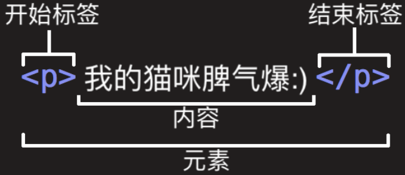

# 简介
超文本标记语言 (英语：Hypertext Markup Language，简称：HTML ) 是一种用来结构化 Web 网页及其内容的**标记语言**。由一系列的元素(elements）组成，这些元素可以用来包围不同部分的内容，使其以某种方式呈现或者工作。

## 元素


- 元素由开始标签、结束标签、内容组成。只包含一个标签的元素称为空元素。
- 元素可以嵌套使用。
- 元素分为块级元素和内联元素。内联元素不可以嵌套块级元素使用。（HTML5摒弃这些术语）
- 元素可以拥有多个属性，属性值不会出现在实际的内容中。
  - 多个属性使用空格隔开。
  - 属性值和属性名使用等号连接。
  - 属性值使用双引号引起来。（推荐始终使用双引号引起来）
  - 只有属性名的属性称为布尔属性，或者属性值只能和其属性名相同。如 `<input type="text" disabled="disabled">`

## 基础HTML页面解析
```
<!DOCTYPE html>
<html>
  <head>
    <meta charset="utf-8">
    <title>测试页面</title>
  </head>
  <body>
    
  </body>
</html>
```

- `<!DOCTYPE html>`: 文档类型。如今已经没有什么实际作用，当成规范就行。是历史遗留问题。
- `<html></html>`: 该元素包含整个页面的内容，也称作根元素。
- `<head></head>`: 用户不可见，其中包含例如面向搜索引擎的搜索关键字（keywords）、页面描述、CSS 样式表和字符编码声明等。
  - `<meta charset="utf-8">` — 文档编码。
  - `<title></title>`: 页面标题。
- `<body></body>`: 用户在访问页面时看到的内容，包括文本、图像、视频、游戏、可播放的音轨或其他内容。

## 其他规范
1. 名命：使用“-”连接的小写英文。
2. 空白：只是用来增强可读性，无实际作用。
3. 特殊字符：`<`, `>`,`"`,`'` 和 `&` 是特殊字符. 它们是HTML语法自身的一部分。如果需要在文本中显示，则需要使用“[实体引用](https://en.wikipedia.org/wiki/List_of_XML_and_HTML_character_entity_references)”代替。
4. 注释：使用特殊的记号<!--和-->包括起来。`<!-- <p>我在注释内！</p> -->`


html 是具有语义性的，而css是表象的。


## head 元素
1. `<title>`: 用于表示整个 HTML 文档的标题（而不是文档内容）。
2. `<meta>`: 元数据。当你在网站上查看源码时，你也会发现其他类型的元数据。你在网站上看到的许多功能都是专有创作，旨在向某些网站(如社交网站)提供可使用的特定信息。如 Facebook 编写的元数据协议 [Open Graph Data](https://ogp.me/) 为网站提供了更丰富的元数据
   ```
   <meta charset="utf-8">  <!-- 编码 -->

   <meta name="author" content="Chris Mills"> <!-- 作者 -->
   <meta name="description" content="...."> <!-- 描述 -->
   ```
3. 图标，出现在页面的标签栏和书签栏中。
   ```
   <link rel="shortcut icon" href="favicon.ico" type="image/x-icon">
   ```
4. 语言
   - `<html lang="zh-CN">` 全局语言。
   - `<p>日语实例: <span lang="jp">ご飯が熱い。</span>.</p>` 局部语言。
5. 引用 CSS
   `<link rel="stylesheet" href="my-css-file.css">`  经常位于文档的头部。
6. 引用 JavaScript
   `<script src="my-js-file.js"></script>` 放在文档的尾部（在 `</body>`标签之前）是一个更好的选择。

  
  ## 文字处理
  |  | 标签 | 说明 | 示例 |
  |--|------|-----|------|
  |标题|`<h1>`、`<h2>`、`<h3>`、`<h4>`、`<h5>`、`<h6>`|应该最好只对每个页面使用一次`<h1>`,这是顶级标题，所有其他标题位于层次结构中的下方。| |
  |段落|[`<p>`](https://developer.mozilla.org/zh-CN/docs/Web/HTML/Element/p)| | |
  | | `<span>` | 内联，不具有任何语言，仅当需要对其使用CSS时 | |
  |无序列表|`<ul>`| 默认每项前有一个原点,可以嵌套使用 | ```<ul><li>第一项</li></ul>``` |
  |有序列表|`<ol>`| 默认每项前有一个数字,可以嵌套使用 | ```<ol><li>第一项</li></ol>``` |
  | 强调 | `<em>` | **语义**强调，斜体 | `<p>I am <em>glad</em> you weren't <em>late</em>.</p>` |
  |非常强调| `<strong>` |**语义**非常强调，粗体| `<p>This liquid is <strong>highly toxic</strong>.</p>` |
  |斜体字、粗体字、下划线| `<b>`, `<i>`, 和 `<u>`| 只是表象元素，不具有语言，推荐使用css实现| |

## 超链接
正是因为有超链接的存在，才使得互联网称为**互联**的网络。超链接可链接到**任何资源**（HTML、CSS、图片、音频、视频等等），也可以链接到文档的**指定部分**（锚点）。URL可以使用相对链接，也可以使绝对链接。如果浏览器不知道如何显示或处理文件，它会询问您是否要打开文件（需要选择合适的本地应用来打开或处理文件）或下载文件（以后处理它）。

链接使用[`<a>`](https://developer.mozilla.org/zh-CN/docs/Web/HTML/Element/a#attr-href)标签包裹，可以是任何内容（包括块级内容）变成超链接。

示例如下：
```
<a href="https://www.mozilla.org/zh-CN/">Mozilla 主页</a>

# 标题仅当鼠标悬停在其上时才会显示
<a href="https://www.mozilla.org/zh-CN/"  title="了解 Mozilla 使命以及如何参与贡献的最佳站点。">Mozilla 主页</a>  

# 块级内容
<a href="https://www.mozilla.org/zh-CN/"></a>

# 使用锚点定位到指定位置（链接到当前文档（html）的 id 为`Mailing_address` 的地方）
<p>本页面底部可以找到 <a href="#Mailing_address">公司邮寄地址</a>。</p>
```

最佳实践：
- 使用清晰的链接措辞。
- 尽可能使用相对链接。（减少DNS查询）
- 链接到非HTML资源时留下清晰的指示。如：`<p><a href="http://www.example.com/large-report.pdf">下载销售报告（PDF, 10MB）</a></p>`
- 在下载链接时使用 download 属性，设置默认文件保存名。


[HTML 元素参考](https://developer.mozilla.org/zh-CN/docs/Web/HTML/Element)